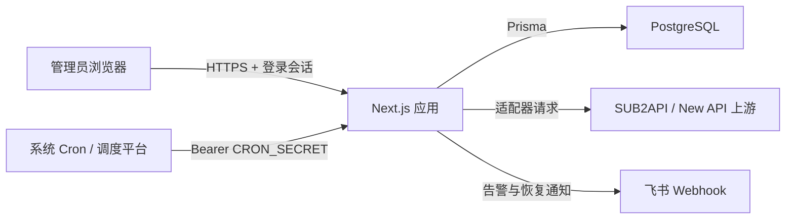
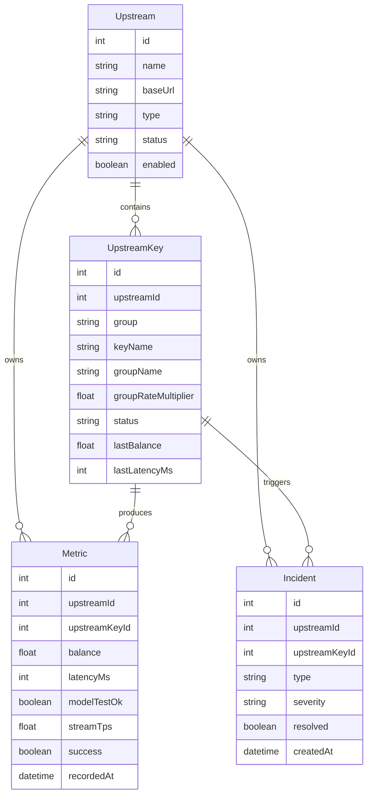
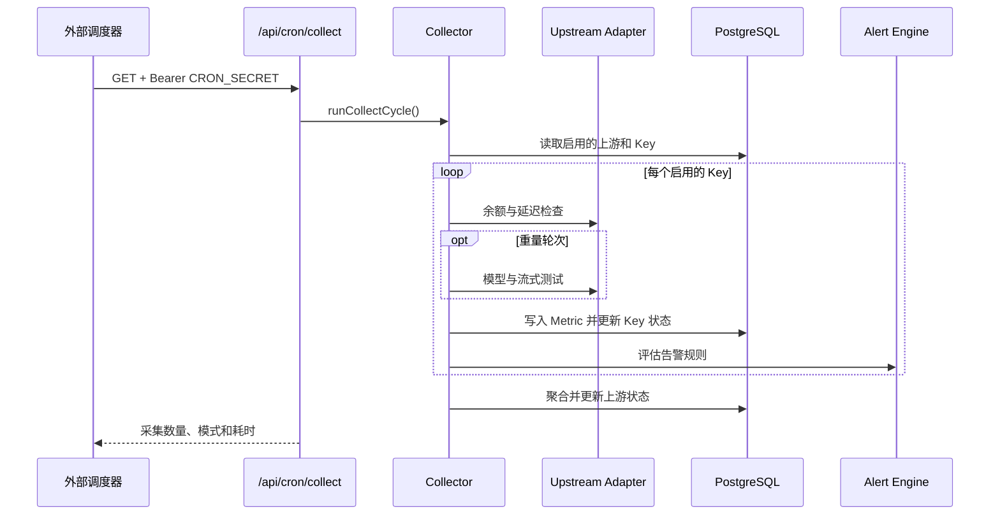

# Relay Status Monitor 系统架构

本文描述公开版本的系统边界、核心数据流和扩展方式。示例名称和地址均为合成内容。

## 设计目标

- 在一个面板中管理多个 AI API 中转站及其 Key/分组。
- 用轻量检查覆盖日常可用性，用低频重量测试验证真实生成能力。
- 将上游差异限制在适配器层，保持采集、告警和界面逻辑稳定。
- 不向浏览器返回上游凭证明文或数据库中的加密值。
- 支持单机自托管，并保留扩展新适配器和通知渠道的边界。

## 系统上下文



Next.js 同时承载界面、API Route 和服务端业务逻辑。PostgreSQL 是唯一持久化数据源；定时调度由应用外部触发，应用负责决定本轮执行轻量还是重量采集。

## 模块边界

| 模块 | 职责 |
| --- | --- |
| Dashboard 页面 | 总览、上游管理、上游详情、告警事件和系统设置 |
| API Routes | 登录、CRUD、指标查询、手动刷新、手动测试与 CRON 入口 |
| Adapter | 屏蔽不同上游的认证方式、字段结构和请求端点差异 |
| Collector | 解密凭证、执行采集、写入指标、更新 Key/上游状态 |
| Alert Engine | 按 Key 评估规则、执行冷却、创建或自动恢复事件 |
| Notification Channel | 将告警和恢复事件发送到已启用渠道 |
| Prisma | 数据访问、关系约束和级联清理 |

## 核心数据模型



其他配置实体包括：

- `AlertRule`：指标、比较符、阈值、严重级别和冷却时间。
- `AlertChannel`：通知渠道类型和 JSON 配置。
- `Setting`：采集间隔、测试模型、超时和 CRON 密钥等键值设置。
- `User`：管理员用户名和 bcrypt 密码哈希。

上游删除时，其 Key、指标和告警事件会按 Prisma 关系级联删除。Key 删除时，对应指标会级联删除，告警事件保留但解除 Key 关联。

## 采集流程

### 定时采集



外部调度器建议每分钟请求一次。当前采集器按“重量采集间隔”决定本轮模式：

- `light`：查询余额和 `/v1/models` 延迟，不发送生成请求。
- `heavy`：包含 light 的全部检查，并执行非流式与流式模型测试。

各 Key 的采集相互隔离；单个请求失败会写入该 Key 的指标和错误状态，不应阻断其他 Key。

### 手动刷新与测试

- `POST /api/upstreams/:id/refresh`：对目标上游的全部启用 Key 执行 light 采集。
- `POST /api/keys/:keyId/test`：对单个 Key 执行 heavy 采集。
- `POST /api/keys/:keyId/metadata`：重新同步支持的远端 Token/分组元数据。

刷新和测试完成后都会重新计算上游汇总状态。所有 Key 在线时上游为在线；全部离线时为离线；混合状态或存在降级时为降级；没有启用 Key 时为未知。

## 适配器接口

采集器只依赖统一的 `UpstreamAdapter`：

```ts
interface UpstreamAdapter {
  readonly type: UpstreamType;
  queryBalance(ctx: AdapterContext): Promise<BalanceResult>;
  testLatency(ctx: AdapterContext): Promise<LatencyResult>;
  testModel(ctx: AdapterContext, model: string): Promise<ModelTestResult>;
  testStream(ctx: AdapterContext, model: string): Promise<StreamTestResult>;
  listModels(ctx: AdapterContext): Promise<{
    ok: boolean;
    models?: string[];
    errorMessage?: string;
  }>;
  fetchKeyMetadata?(ctx: AdapterContext): Promise<KeyMetadataResult>;
}
```

### SUB2API

- API Key 通过 Bearer Header 访问用量、模型列表和 Chat Completions。
- 余额字段按 `remaining`、`balance`、`quota.remaining` 等兼容顺序解析。
- 普通 API Key 无法保证访问管理接口，分组元数据只采用响应中明确存在的字段。

### New API

- API Key 用于 Token 用量、模型列表和 Chat Completions。
- Access Token 与用户 ID 用于 `/api/user/self`、Token 搜索和用户分组配置。
- `/api/user/self` 的用户分组不能替代 Token 的真实分组。
- 元数据同步允许部分成功：已经获取到的名称或分组可以保存，失败信息单独记录，旧值不会被无条件清空。

## 告警流程

每次 Key 采集结束后，告警引擎评估全部启用规则：

- 余额低于或高于阈值；
- 延迟高于或低于阈值；
- 连续失败次数达到阈值；
- 最近一小时可用率低于阈值。

触发规则后，系统先检查同一 Key、同一事件类型的冷却窗口，再创建 `Incident`。当前通知实现会向所有已启用的飞书渠道发送交互式卡片。Key 恢复在线后，未解决事件会自动标记为已恢复并发送恢复通知。

## API 边界

| API | 方法 | 用途 |
| --- | --- | --- |
| `/api/auth/login` | `POST` | 创建管理员会话 |
| `/api/upstreams` | `GET/POST` | 分页查询或创建上游 |
| `/api/upstreams/:id` | `GET/PUT/DELETE` | 获取、更新或删除上游 |
| `/api/upstreams/:id/keys` | `GET/POST` | 查询或创建 Key |
| `/api/upstreams/:id/refresh` | `POST` | 上游级轻量刷新 |
| `/api/keys/:keyId/test` | `POST` | 单 Key 完整测试 |
| `/api/keys/:keyId/metadata` | `POST` | 刷新远端 Key 元数据 |
| `/api/metrics` | `GET/DELETE` | 查询指标或清理历史指标 |
| `/api/incidents` | `GET` | 查询告警事件 |
| `/api/settings` | `GET/PUT` | 读取或更新系统设置 |
| `/api/cron/collect` | `GET` | 使用 CRON_SECRET 触发采集 |

除登录和 CRON 入口外，Dashboard 页面与 API 由登录中间件保护。CRON 入口不使用登录 Cookie，只接受独立 Bearer 密钥。

## 安全边界

- API Key 与 Access Token 使用 AES-256-GCM 加密，密钥由 `APP_ENCRYPTION_KEY` 通过 scrypt 派生。
- 管理员密码只保存 bcrypt 哈希。
- 会话 JWT 通过 HttpOnly、SameSite Cookie 传递；生产模式下 Cookie 标记为 Secure。
- 面向浏览器的 Key DTO 移除密文，只暴露是否已配置凭证。
- `CRON_SECRET` 可以来自数据库设置或环境变量，数据库值优先。
- `AlertChannel.config` 和 `Setting` 可能包含敏感配置，因此数据库备份也应按密钥材料保护。

`APP_ENCRYPTION_KEY` 不是可随意轮换的普通配置。直接更换会导致现有上游凭证无法解密，并使既有会话失效；轮换前必须先设计数据迁移。

## 扩展方式

### 新增上游类型

1. 扩展 Prisma `UpstreamType` 并更新数据库。
2. 实现 `UpstreamAdapter`，使用统一的超时与脱敏错误格式。
3. 在适配器注册表中注册实现。
4. 更新管理表单中的类型和凭证字段。
5. 验证轻量、重量、元数据、失败隔离和安全 DTO 行为。

### 新增通知渠道

1. 为新渠道定义最小配置结构。
2. 在通知分发器中增加渠道类型。
3. 对发送失败进行隔离，避免影响指标写入和其他渠道。
4. 在设置页提供创建、启用和删除能力。

## 运行约束

- PostgreSQL 是必需依赖，当前不支持 SQLite。
- 重量测试会消耗上游额度，应使用较低频率和低成本模型。
- 应用进程不内置可靠的分布式调度器，生产环境应使用系统 cron 或外部调度平台。
- 多实例部署时，外部调度器只应触发一个入口，避免重复采集和重复告警。
- 删除上游属于破坏性操作，生产操作前应确保数据库备份可恢复。
